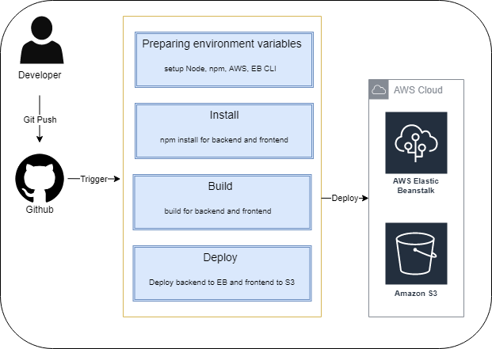

# Pipeline Process

The pipeline is setup and connected with this GitHub repository via CircleCI.

## Order of Process

1. The pipeline uses orbs to install Node, the AWS cli and the EB cli.
2. It checks out the code from the repo
3. BackEnd & FrontEnd install
4. BackEnd & FrontEnd build
5. BackEnd & FrontEnd deploy

## Pipeline diagram

