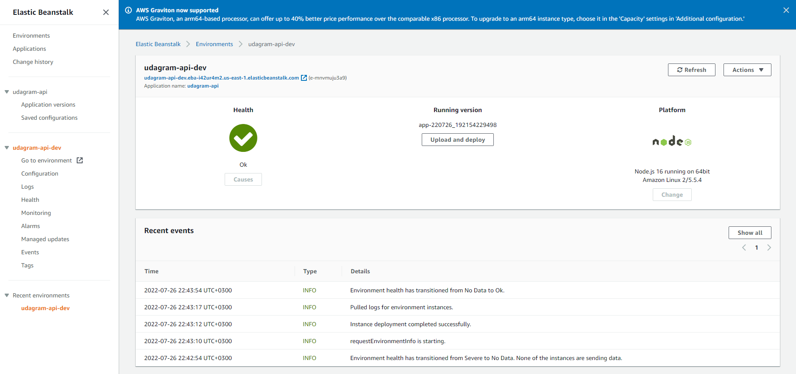
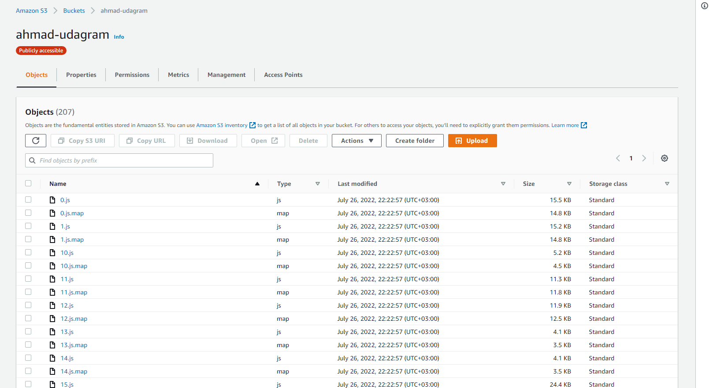
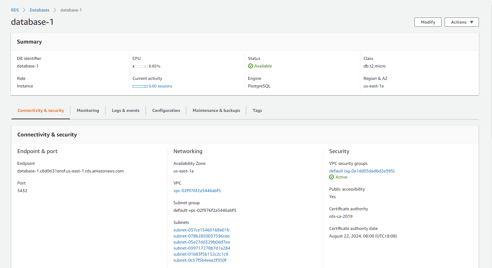
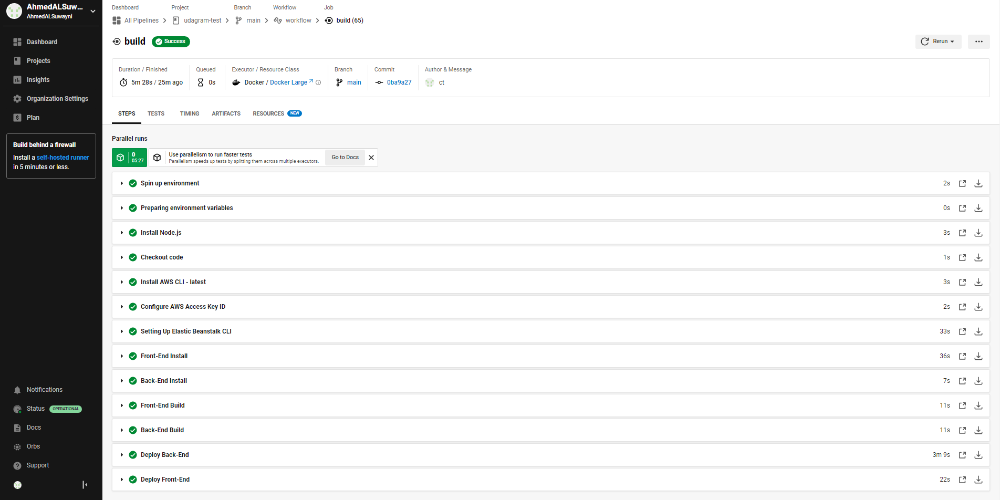
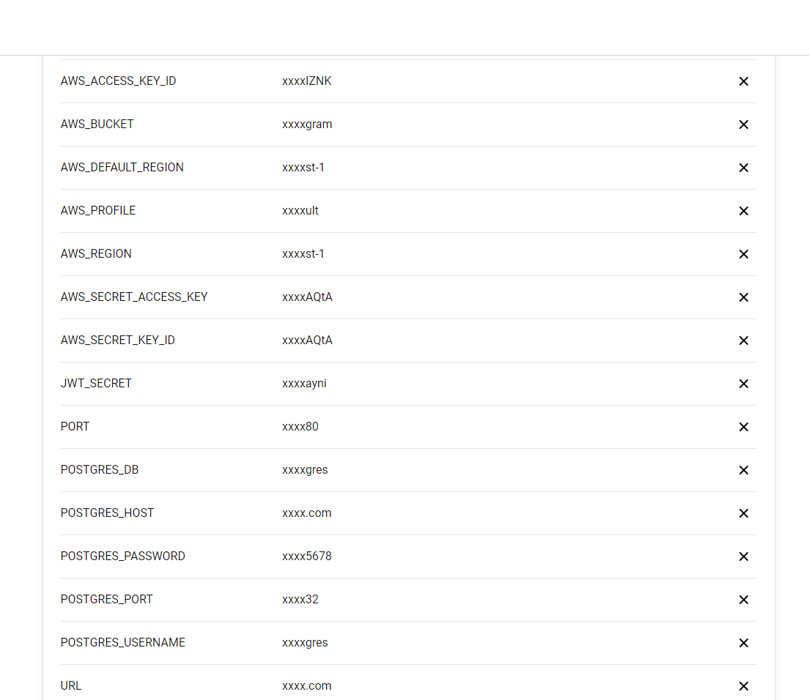
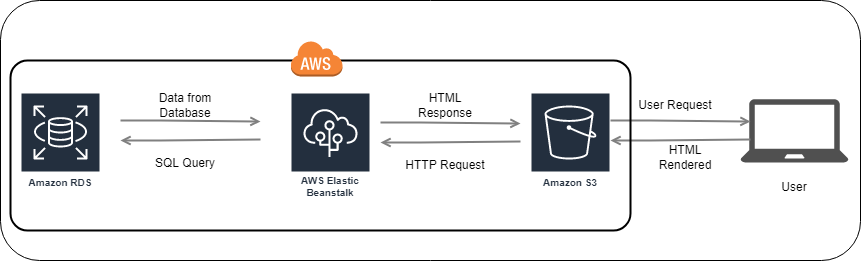

# (Udagram) Hosting a Full-Stack Application
---

This application is provided from Udacity to be hosted into AWS with Pipeline using CircleCI.
The Project is for the Advanced Full-Stack Web Development Nanodegree Program - Deploying & Hosting a Full-Stack Application.

The project is available at

[http://udagramfrontendbucket.s3-website-us-east-1.amazonaws.com
](http://ahmad-udagram.s3-website-us-east-1.amazonaws.com/)

## Configuration Screenshots
### Elastic Beanstalk Environment



### FrontEnd S3 Bucket




### RDS database



### CircleCI Pipeline



Environment Variables



CircleCI Pipeline Architecture


### AWS Architecture


### Dependencies

```
- Node 16.13.20 or more recent

- npm 8.1.2

- AWS CLI v2

- RDS database Postgres
